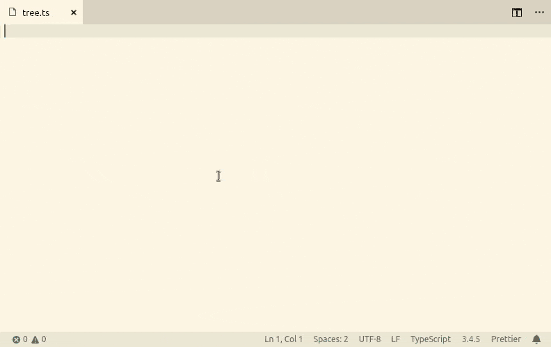

# fp-ts Codegen

Expands haskell-syntax ADTs to typescript equivalent types definitions using [gcanti/fp-ts-codegen](https://github.com/gcanti/fp-ts-codegen), check the [online playground](https://gcanti.github.io/fp-ts-codegen/).

## Features

## Extension Settings

This extension contributes the following settings:

* `fp-ts-codegen.tagName`: the name of the field used as tag
* `fp-ts-codegen.foldName`: the name prefix used for pattern matching functions
* `fp-ts-codegen.matcheeName`: the name used for the input of pattern matching functions
* `fp-ts-codegen.handlersStyle`: the pattern matching handlers can be expressed as positional arguments or a single object literal `tag -> handler`
* `fp-ts-codegen.handlersName`: the name used for the handler if handlersStyle is \"record\"
* `fp-ts-codegen.encoding`: the encoding to generate the types, either `literal` for pure TS or `fp-ts`, to use fp-ts constructs

## Release Notes

### 1.0.0

Initial release of vscode-fp-ts-codegen.

- Use [gcanti/fp-ts-codegen](https://github.com/gcanti/fp-ts-codegen) for expanding ADTs
